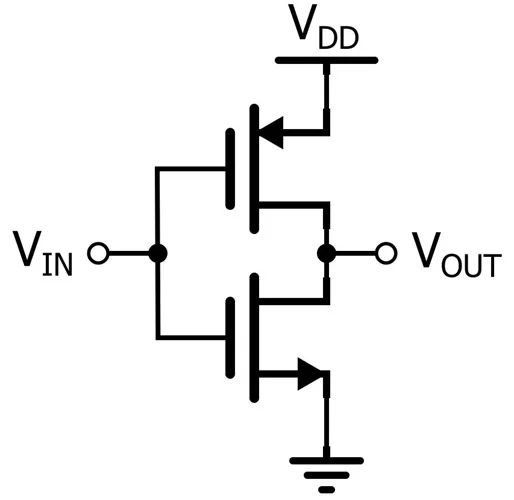
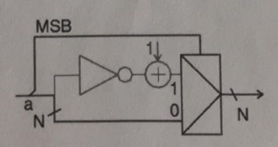
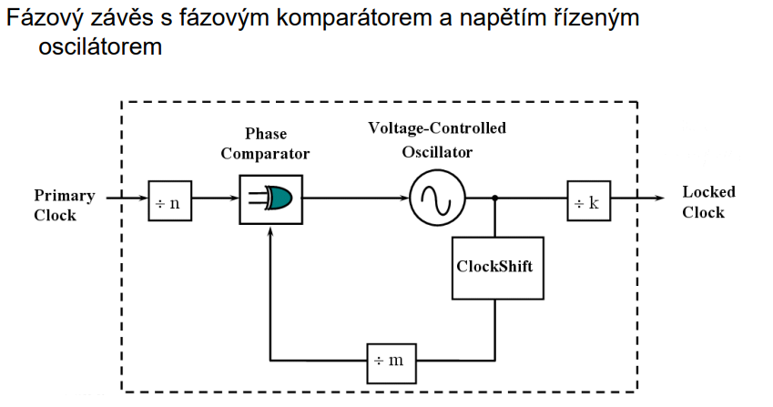
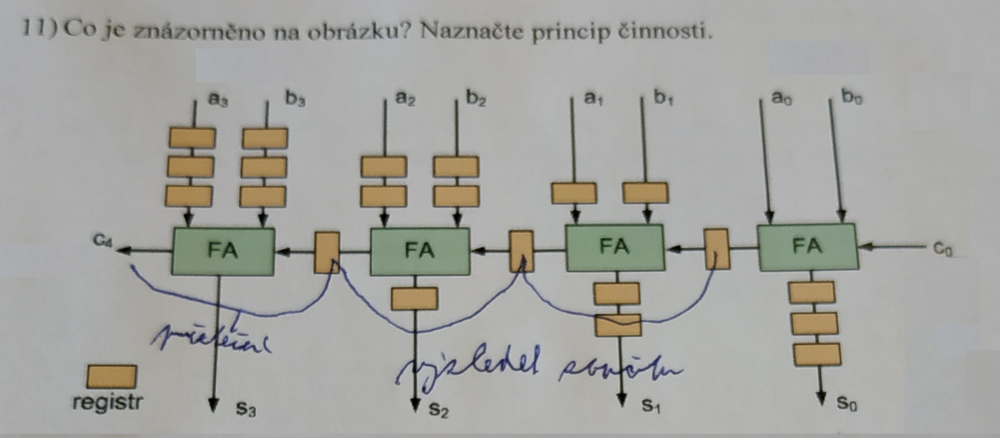

### **Obrázek 1: "Návrh hardwarových komponent – písemný test R"**

1. Pro uchovávání konfiguračních dat v FPGA obvodech se nejčastěji používá technologie založená na pamětích SRAM. Jaké má tato technologie výhody oproti ostatním používaným technologiím (anti-fuse nebo EEPROM)?
**Reprogramovatelnost**, externí paměť, velikost konfigurace, **rychlost** zápisu.

2. **Na jakém principu se realizuje kombinační a sekvenční logika v obvodech CPLD (Complex Programmable Logic Device)?**
Na základně centrální propojovací matice, která spojuje jednodušší funkční bloky (obdoba SPLD) a na programovatelných logických buňkách, které obsahují logické funkce a klopné obvody.

3. **Jakým způsobem se principiálně popisují stavové automaty v jazyce VHDL? Jaký je rozdíl mezi popisem stavového automatu typu Mealy a Moore?**
Stavové automaty se v jazyce VHDL popisují pomocí procesu, který reaguje na změny vstupních signálů a hodinového signálu. Rozdíl mezi Mealy a Moore automatem spočívá v tom, že Mealy automat může měnit výstupy na základě aktuálních vstupů a vnitřího stavu, zatímco Moore automat mění výstupy pouze na základě aktuálního vnitříhé stavu.

4. **Nakreslete základní zapojení invertoru v technologii CMOS a jeho závislost U₂ = f(U₁). Za jakých podmínek nastává změna U₂ právě při U₁ rovnající se zhruba polovině napájecího napětí?**


Změna U₂ nastává při U₁ rovnající se zhruba polovině napájecího napětí, když je vstupní napětí U₁ překročeno prahovou hodnotu, což je obvykle kolem 1/3 až 2/3 napájecího napětí v závislosti na konkrétní technologii CMOS (velikost tranzistorů, prahové napětí atd.).

5. **Ve třívoltové technologii CMOS je možné zatížit I/O buňku maximálním výstupním proudem 2 mA. Na výstupním pinu je připojena zátěž o parazitní kapacitě 40 pF. Jaká maximální frekvence signálu může být zhruba přenášena na tomto pinu?**

Maximální frekvence signálu lze odhadnout pomocí vzorce pro čas potřebný k nabití kapacity:
I = 2mA; U = 3V; C = 40pF
$$
\varDelta t = 40 * 10^{-12}F \frac{3V}{2 * 10^{-3}} = 60 \,  ns
$$
Maximální frekvence je tedy přibližně:
$$
f_{max} = \frac{1}{\varDelta t} = \frac{1}{60 * 10^{-9}} \approx 16.67 \, MHz
$$


6. **Co popisuje uvedený proces? Nakreslete schéma nebo značku a pojmenujte jednotlivé signály.**

```vhdl
entity demux is
    port (
        a, b: in bit;
        c, d: out bit
    );
end entity;

architecture behavioral of demux is

c <= a when b = '0' else '0';
d <= a when b = '1' else '0';
end architecture;
```

Je to demultiplexor který vybíra jeden vstup A a pomocí B ho přepíná na C nebo D;


7. **K čemu slouží seznam citlivých signálů (sensitivity list) u příkazu „process“ a co uvádíme v tomto seznamu jednak u kombinačních obvodů a jednak u sekvenčních obvodů?**

Seznam citlivých signálů u příkazu „process“ určuje, na které signály bude proces reagovat. U kombinačních obvodů zahrnuje všechny vstupní signály, které mohou ovlivnit výstup, zatímco u sekvenčních obvodů zahrnuje obvykle hodinový signál a další signály, které spouští změny stavu (např. reset).

8. **Naznačte příčiny vzniku metastability v elektronických obvodech. V čem spočívá nebezpečnost metastability?**

Metastabilita vzniká, když se vstupní signál mění v blízkosti aktivní hrany hodinového signálu, což může vést k tomu, že klopný obvod (např. D-klopný obvod) se nedokáže stabilizovat na jednoznačné logické úrovni. Nebezpečnost metastability spočívá v tom, že může vést k nejednoznačnému chování obvodu, což může způsobit chyby v logice a nefunkčnost celého systému.

9. **Vstupně-výstupní buňky FPGA obvodů sdružují do bank. Co označujeme pojmem banka a jaký je její účel?**
Banka je skupina I/O pinů, které sdílejí společné napájení a zem. Jejich účelem je umožnit efektivní připojení k vnějšímu světu a zjednodušit návrh obvodu.

10.  **Naznačte princip metody Random Access Scan při testování integrovaných obvodů. Uveďte její výhody a nevýhody ve srovnání s jinými metodami typu Scan.**
  
Random Access Scan umožňuje přímý přístup ke všem bistabilům (flip-flopům) v čipu pomocí adresování, čímž zrychluje testování a snižuje počet taktů potřebných k nastavení a čtení jejich stavů.

Výhody:

- velmi rychlý přístup k libovolnému flip-flopu
- snižuje počet taktovacích cyklů oproti klasickému serial scan

Nevýhody:

- složitější řídicí logika
- větší plocha čipu a vyšší režie (overhead) než u jednoduchého scan řetězce

11.   **Na obrázku je principiální schéma jedné základní aritmetické operace (vstupem je N-bitové číslo a). O jakou operaci se jedná? Popište princip činnosti.**


Jedná
---

### NHK – písemný test S"**

1. **Co jsou to adaptivní logické moduly? Kde se používají? Jaké mají výhody?**

Adaptivní logické moduly jsou specializované bloky v FPGA, které umožňují dynamickou změnu konfigurace logiky za běhu. Používají se zejména v aplikacích, kde je potřeba flexibilita a schopnost přizpůsobit se měnícím se podmínkám, jako jsou například adaptivní filtry nebo systémy pro zpracování signálů. Výhody zahrnují schopnost optimalizovat výkon a spotřebu energie v reálném čase a možnost implementace složitých funkcí bez nutnosti fyzické změny hardwaru.

2. **Naznačte smysl/princip metody nazývané „synchronizace registrů“ (Register retiming) při návrhu obvodů. Jaké přináší výhody?**

Přesunutí registrů v obvodu za účelem optimalizace časování a zkrácení doby průchodu signálu. Tato metoda umožňuje zlepšit maximální pracovní frekvenci obvodu tím, že se minimalizuje zpoždění mezi logickými bloky. Výhody zahrnují zvýšení výkonu, snížení spotřeby energie a zlepšení stability obvodu.

3. **Na jakém principu je založeno násobení vstupních frekvencí v obvodech FPGA? Jaké bloky se k tomuto účelu používají? Naznačte jejich hlavní části (blokové schéma).**

Používají se k tomu fázové závěsy, které dělí nebo násobí vstupní frekvenci a mění střídu signálu.

Blokové schéma může vypadat následovně:
 

4. **Jsou uvedené dva příklady funkčně ekvivalentní? Své tvrzení zdůvodněte.**
   signal cnt1 : unsigned(3 downto 0);

```vhdl
PROCESS(clk)
BEGIN
  IF clk'event AND clk = '1' THEN
    cnt1 <= cnt1 + 1;
    IF cnt1 >= 9 THEN
      cnt1 <= (others => '0');
    END IF;
  END IF;
  count1 <= cnt1;
END PROCESS;
```

```vhdl
PROCESS(clk)
  variable cnt1 : unsigned(3 downto 0);
BEGIN
  IF clk'event AND clk = '1' THEN
    cnt1 := cnt1 + 1;
    IF cnt1 >= 9 THEN
      cnt1 := (others => '0');
    END IF;
  END IF;
  count1 <= cnt1;
END PROCESS;

```
Funkčně ekvivaletní nejsou protože v prvním případě je cnt1 signál a v druhém proměnná. Proměnná se aktualizuje okamžitě, zatímco signál se aktualizuje až na konci procesu.

5. **Jaký obvod popisuje uvedený proces? Nakreslete schéma nebo značku a pojmenujte jednotlivé signály.**
```vhdl
   PROCESS (a)
BEGIN
  IF (a'event AND a = '1') THEN  -- Hrana hodin (rising edge)
    IF b = '1' THEN              -- Enable podmínka
      c <= not c;                -- Invertuj výstup
    END IF;
  END IF;
END PROCESS;
```
Je to jednoduchý registrový invertor s enable signálem. Tedy T klopný obvod.

6. **Vysvětlete, jakým způsobem/principem dvojitý synchronizátor eliminuje metastability.**

 Dvojitý synchronizátor používá dva po sobě jdoucí klopné obvody, které vzorkují vstupní signál. První klopný obvod může být v metastabilním stavu, ale druhý klopný obvod má dostatek času na to, aby se stabilizoval a poskytl jednoznačný výstup. Tím se snižuje pravděpodobnost, že metastabilní stav bude přenesen do další části obvodu.

2. **Jaký je rozdíl mezi vloženou (embedded) pamětí a distribuovanou pamětí v FPGA obvodech?**

Rozdíl je v tom, že vložená paměť je specializovaný blok s pevně danou strukturou a velikostí, který je optimalizován pro rychlý přístup a efektivní využití plochy čipu. Distribuovaná paměť využívá logické buňky (např LUT) k vytvoření menších paměťových bloků, které jsou flexibilnější, ale mohou mít omezenou kapacitu a rychlost. Vložená paměť je obvykle rychlejší a efektivnější pro větší objemy dat, zatímco distribuovaná paměť je vhodná pro menší množství dat a flexibilní konfiguraci.

8. **Napěťové standardy I/O buněk FPGA obvodů se dělí na dvě skupiny (single-ended a differential). Uveďte jejich výhody a nevýhody; u každé skupiny jmenujte alespoň jednoho představitele.**

Single-ended napěťové standardy:
- **Výhody**: jednodušší návrh, nižší náklady, menší počet potřebných pinů.
- **Nevýhody**: náchylnější k rušení a šumu, omezená rychlost přenosu.
- **Představitel**: LVCMOS (Low Voltage CMOS).

Differential napěťové standardy:
- **Výhody**: vyšší odolnost vůči rušení, lepší signál-noise ratio, vyšší rychlost přenosu.
- **Nevýhody**: složitější návrh, vyšší náklady, potřeba více pinů pro každý signál (dva piny pro pár).
- **Představitel**: LVDS (Low Voltage Differential Signaling).

---

9. K čemu slouží metoda Boundary Scan? Naznačte její princip, výhody a nevýhody.

Boundary Scan je metoda testování integrovaných obvodů, která umožňuje přístup k vnitřním signálům čipu pomocí speciálních testovacích pinů. Princip spočívá v tom, že se do obvodu přidají speciální registrové buňky, které umožňují sériové čtení a zápis dat do těchto buněk, čímž se získá přístup k vnitřním signálům.

Výhody:
- umožňuje testování bez fyzického přístupu k vnitřním signálům,
- zjednodušuje diagnostiku a ladění obvodů,
- snižuje náklady na testování a výrobu.
Nevýhody:
- zvyšuje složitost návrhu obvodu,
- vyžaduje speciální testovací hardware a software,
- může zvýšit spotřebu energie a plochu čipu.

10. Kolik napájecí napětí ma typický obvod FPGA? K čemu se jdnotlivá napětí používají?
Typický obvod FPGA obvykle používá několik napájecích napětí, například:
- **VCCINT** (napájení vnitřní logiky) – obvykle 1.0V až 1.2V, napájí logické bloky a paměťové buňky.
- **VCCIO** (napájení I/O pinů) – obvykle 1.8V, 2.5V nebo 3.3V, napájí vstupně-výstupní buňky a umožňuje kompatibilitu s různými napěťovými standardy.
- **VCCAUX** (napájení pomocných obvodů) – obvykle 1.8V, napájí pomocné bloky jako jsou PLL, DSP a další specializované funkční bloky.

11. Co je znázorněno na obrázku? Naznačte princip činnosti.


Obrázek znázorňuje 4bitovou ripple carry paralelní sčítačku, kde se všechny bity zpracovávají zároveň, jen s kaskádním přenosem mezi jednotlivými sčítačkami.


---

# Výpisky

## Zásady návrhu hardwarových komponent

Nejčastění používaná úroveň je RTL

**Pipelining** – zrychlení obvodu pomocí rozdělení na více kombinačních částí, které se provádějí paralelně

**Retiming** – přesun registrů v obvodu, aby se zkrátila doba průchodu signálu

**Metoda replikace registrů** – zrychlení obvodu pomocí duplikace registrů, aby se snížila zátěž na jednotlivé části

**Sdílení prostředků** – snižuje množství potřebné logiky na úkor maximální pracovní frekvence

**Časová doména** - část obvodu, jehož regitry jsou řízeny(buzeny) stejným hodinovým signálem

Vše navrhovat synchronně (nejlépe 1 časová doména, příp. důsledně oddělit jednotlivé časové domény)

- podpora v návrhových systémech,
- snadno testovatelné,
- odolnější vůči šumům (přeslechy, odrazy, hazardy, …),
- funkčnost nezávisí na konkrétním rozmístění a propojení,
- funkční simulace souhlasí se simulací časovou
- při použití více časových domén většinou časové simulace neodhalí problémy (zejména možné metastability).

Jako hodinový signál nikdy nepoužívat výstup s logiky.

**Přenos signálů mezi čas. doménami**
Data se na vstupu mohou měnit i v době příchodu aktivní hrany
hodinového signálu

- vznikají kritická časová okna, kdy není dodržena doba předstihu
$t_{tset-up}$, doba přesahu
th_{hold} a doba zotavení po resetu $t_{trr}$.
- na výstupu KO může vzniknout nedefinovaný stav, který mohou
následné vstupy vyhodnotit rozdílně.

**Metastabilita** – stav, kdy se signál nachází mezi 2 logickými úrovněnmi a neustálí se v přesně definovaném čase. Může vést k nejednoznačnému chování obvodu

- proudové špičky na napájení
- nekorektní přechody mezi stavy
- nekorektní hodnoty na sběrnicích

**MTBF** (Mean Time Between Failures) – střední doba bezporušného provozu
$$
MTBF = \frac{e^{T \varDelta t}}{f_{in}f_{clk}T_0}
$$
kde:

- $T, T_0$ – pravděpodobnostní konstanty výskytu chyby v dané architektůře
- $f_{in}$ – frekvence vstupních signálů
- $f_{clk}$ – frekvence hodinového signálu
- $\varDelta t$ – doba zpožděného vzorkování výstupního signálu

**Poruchovost návrhu** – pravděpodobnost, že dojde k poruše v daném čase

$$
Q_C = \frac{1}{MTBF_C} = \sum_{i=1}^{n} Q_i
$$

**Synchronizátory** – obvody, které zajišťují nebo minimálně snižují pravděpodobnost, že data přicházející z jedné časové domény do druhé budou stabilní

Synchronizace sběrnic - AXI handshake, enable, ready, valid

Pro přenos dat mezi časovými doménami lze použít fronty s využitím
paměti FIFO s asynchronními hodinami (dual clock FIFO)

- využíváme zejména v případě, kdy je zpoždění spojené s resynchronizací nepřípustné

**Nekoherence** – stav, kdy se data v různých částech systému liší, i když by měla být shodná, vzniká přivodem více asynchronních signálů do jedné časové domény současně

**Dvouhrannové klopné obvody** - reaguji na rising i falling hranu hodinového signálu, časté pro RAM a paměti, jinak nepoužívat

**Náhrada sběrnic multiplexorem** - zjednodušení návrhu, snížení počtu signálů
- třístavové výstupy jsou pomalejší, někdy uvnitř FPGA nedostupné
- vhodné zejména pro menší počet větvení

### Makrobloky, jádra

**Makro** je definováno jako část navrhovaného systému, která je
použitelná jako samostatný stavební blok.
Používání maker výrazně zkracuje a zlevňuje návrh.
Dva typy makrobloků:

- **soft core** – forma syntetizovatelného RTL kódu;
- **hard core** – výstupem je hotový layout (závislé na technologii),
  - úspora místa na čipu (ve srovnání s realizací v log. buňkách),
  - vyšší pracovní kmitočet,
  - snížení spotřeby bloku (malá plocha, optimalizace),
  - možnost implementovat i nestandardní (např. analogové) bloky,
  - funkce pevně dána, nelze upravovat.

Základní vlastnosti makrobloků:

- souhlasí s příslušnými normami (standard compliant),
- vesměs verifikované pomocí FPGA obvodů, bloky pro testování,
- parametrické (např. v tabulkách uvedená různá velikost makrobloku
pro proměnnou šířku sběrnice),
- integrované, spolehlivé a snadno použitelné,
- dobře zdokumentovatelné pomocí kompletní technické specifikace,
- podpora použití (od výrobce), aj.
IP bloky – navržené makrobloky, často nutné zakoupit licenci
(Intellectual Property – intelektuální vlastnictví).

## Programovatelné zakázkové integrované obvody

Dělení FPLD
**FPLD** – Field Programmable Logic Device:

**PLD** (Programmable Logic Device)

**SPLD** (Simple PLD)
- pevně daná struktura typu: vstup - pole AND - pole OR - výstup
- PROM (Programmable Read Only Memory),
- PAL (Programmable Array Logic),
  - GAL (Generic Array Logic),
- PLA (Programmable Logic Array),

**CPLD** (Complex PLD)
- složitější architektury vycházející z SPLD (vrstevnaté, s centrální
propojovací maticí).

**FPGA** (Field Programmable Gate Array)
- pravidelná struktura programovatelných log. bloků s vodorovnými
či svislými propojovacími linkami a propojovacími maticemi.

Typy propojek:

- Fusible-link 
- Antifuse – bezpečné a spolehlivé, vhodné pro sériové použití, vyšší odpor propojek (menší rychlost);
- EPROM
- EEPROM/FLASH - nevolatilní, ale přesto rekonfigurovatelné, bezpečné vhodné pro menší a levnější FPGA
- SRAM - zejména u velkých FPGA, velká rychlost a výborná
rekonfigurovatelnost

### PROM
- programovatelné pole OR
- počet programovatelných bodů: $N = m.2^n$
n - počet vstupů, m - počet výstupů
- EEPROM (Electrically Erasable PROM)
- použití jako paměť konstant

### PAL
- programovatelné pole AND
- počet programovatelných bodů: $N = 2m.k.n$
- omezený počet součinových termů k
- na výstupu mohou obsahovat klopné obvody

### GAL
- vychází z PAL
- na výstupu makrobuka Output Logic Macro Cell
- každý I/O lze konfigurovat jako vstup, výstup nebo třístavový výstup
-  některé z konfigurovatelných parametrů pouze globální

### PLA
- programovatelné pole AND i OR
- počet programovatelných bodů: $N = m.k + 2k.n$
- odstraňuje omezení v počtu součinových termů

### CPLD
- složitostí mezi PLD a FPGA;
- obsahují centrální propojovací matici, která spojuje jednodušší
funkční bloky (obdoba SPLD);
- elektricky reprogramovatelné (EECMOS);
- I/O buňky programovatelné, vesměs obousměrné.

PSM (Programmable Switch Matrix) – centrální propojovací matice CPLD, propojuje horizontálně a vertikálně umístěné logické bloky

### Hrubozrnné struktury (Course Grained)

- velké množství logiky v každém modulu
- menší možná využitelnost logiky
- větší a těžko předvídatelné zpoždění
- větší spotřeba energie
- vhodné pro větší funkce
- typické pro PLD, CPLD

### Jemnozrné struktury (Fine Grained)

- jednodušší logické moduly
- lepší využitelnost logiky
- snadnější syntéza
- lépe odhadnutelné zpoždění
- obtížnější realizace větších funkcí
- typické pro FPGA

Velikost FPGA udávaná v počtu logických elementů (LE) nebo logických bloků (LB), které jsou tvořeny LUT (Look-Up Table) a KO.

#### LUT
- na principu SRAM
- implementuje libovolnou logickou funkci pomocí tabulky a multiplexorů
Počet vstupů LUT, obvykle 4, kompromis mezi délkou cesty vs nevyužitá logika

### Vstupně-výstupní buňky (I/O buňky)

Zajišťují tok dat mezi vnitřní logikou a I/O piny;
- přizpůsobují logické úrovně vně a uvnitř čipu,
- zesilují výstupní signály,
- podporují řadu vstupně-výstupních napěťových standardů.
Buňky jsou rozděleny do bank – každou banku lze připojit na jiný
napájecí zdroj.
Většina buněk může být konfigurována jako vstupní, výstupní nebo
obousměrné.
Struktura buňky obsahuje většinou 3 základní signálové cesty:
- vstupní cesta (data z pinu do vnitřní logiky),
- výstupní cesta (přenos dat z vnitřní logiky na výstupní pin),
- cesta ovládající třístavový výstup.
Ve výstupní cestě je zařazen programovatelný výstupní driver:
- umožňuje měnit rychlost přeběhu (2-3 stupně),
- určuje výstupní proudové zatížení (2-25 mA),
- umožňuje nastavení do stavu vysoké impedance.

Součástí I/O buňky jsou:
- pull-up a pull-down rezistory,
- ochrany proti kladnému i zápornému přepětí,
- obvody zajišťující impedanční přizpůsobení (OCT – On-Chip
Termination, DCI – Digitally Controlled Impedance),
- obvod přidržení úrovně (bus hold, keeper, aktivní terminátor).

### Použití RAM v FPGA
1) Klopné obvody v logických buňkách (pro menší množství dat, rychlý přístup);
2) Distribuovaná paměť – využití paměťových buněk v LUTech (omezená velikost, náročné na propojovací sítě);
3) Bloková (embedded) paměť– speciální paměťové bloky vložené do struktury FPGA (snadno konfigurovatelné, plně dvouportové, rychlé, efektivní z hlediska nároků na plochu);
4) Externí paměti – pro uložení velkých objemů dat (nejčastěji dynamické paměti, podpora DDR řadičů v FPGA).

#### DSP
Speciální bloky optimalizované na DPS aplikace
- složeny z násobiček, sčítaček (příp. odečítaček) a registrů;
- jednotlivé bloky jsou mezi sebou vzájemně provázané;
- operace převážně ve formátu fixed point;